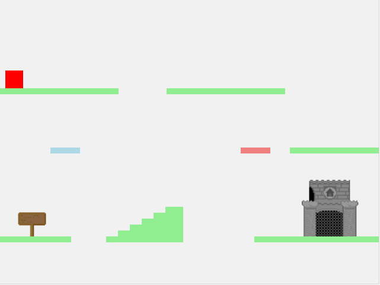

# 2d-platform-game
A huge simple 2d platform game example made with native javascript.

The character has jelly physics, and the different colored platforms have different effects.
And the staircase is cool, just try it!

Your objective is pretty simple, you just need to get to the castle.

Controls:

* Right Arrow - Walk Right
* Left Arrow - Walk left
* Space bar - Jump
